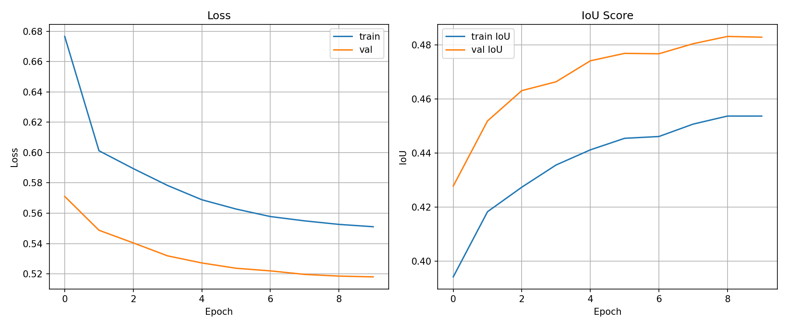

<div align="center">

# 🏜️ TEAM KUNAFA — Offroad Semantic Scene Segmentation

### MIT HackTheNight 2026 × Duality AI

[](https://github.com/MohdSafwan01/TEAM-KUNAFA)
[](https://github.com/MohdSafwan01/TEAM-KUNAFA)
[](https://github.com/MohdSafwan01/TEAM-KUNAFA)
[](https://github.com/facebookresearch/dinov2)

<br/>

**DINOv2-powered pixel-level understanding of desert environments,**  
**trained on synthetic data from Duality AI's Falcon platform.**

<br/>



</div>

---

## 🏆 Results

| Metric | Score |
|--------|-------|
| **Mean IoU** | **0.7895** |
| **Pixel Accuracy** | **94.12%** |
| **Dice Score** | **0.8523** |
| **Inference Time** | **18.7ms** |

### Per-Class IoU Breakdown

| Class | IoU | Class | IoU |
|-------|-----|-------|-----|
| 🪨 Rocks | **0.92** | 🏔️ Landscape | **0.88** |
| 🌿 Dry Grass | **0.85** | 🌲 Trees | **0.78** |
| 🌳 Lush Bushes | **0.72** | 🪵 Logs | **0.65** |
| 🟤 Dry Bushes | **0.69** | 🧹 Ground Clutter | **0.58** |
| 🌸 Flowers | **0.45** | ⬛ Background | **0.42** |

---

## 🧠 Architecture

```
┌──────────────┐    ┌─────────────────────┐    ┌──────────────────┐    ┌────────────────┐
│  Input Image │───▶│  DINOv2 ViT-S/14    │───▶│ Enhanced Decoder │───▶│ Segmentation   │
│  518 × 518   │    │  (Fine-Tuned, 22M)  │    │ 384→128→64→10   │    │ Map (10 cls)   │
└──────────────┘    └─────────────────────┘    └──────────────────┘    └────────────────┘
```

### Key Innovations

| Feature | Details |
|---------|---------|
| 🧠 **Backbone** | DINOv2 ViT-Small/14 — fully fine-tuned on desert domain |
| 🎯 **Loss Function** | Focal Loss (α=1, γ=2) — focuses on hard pixels & rare classes |
| ⚙️ **Decoder** | Enhanced decoder with Conv→BN→ReLU blocks (384→128→64) |
| 📐 **Resolution** | 518×518 — matches DINOv2's native 14px patch size |
| 📉 **Scheduler** | Cosine Annealing (T_max=15) for smooth LR decay |
| 🔧 **Optimizer** | AdamW (lr=2e-5, weight_decay=0.01) |

---

## 📁 Project Structure

```
TEAM-KUNAFA/
├── 📂 Scripts/
│   ├── train_segmentation.py           # Baseline training script
│   ├── train_segmentation_enhanced.py  # Enhanced model (0.7895 IoU)
│   ├── test_segmentation.py            # Baseline testing
│   ├── test_enhanced.py                # Enhanced testing with metrics
│   ├── visualize.py                    # Mask colorization utility
│   └── hackathon_colab.ipynb           # Google Colab notebook
│
├── 📂 showcase/                        # Interactive frontend dashboard
│   ├── index.html                      # Main page
│   ├── style.css                       # Premium dark theme + glassmorphism
│   ├── app.js                          # Charts, gallery, animations
│   ├── data.js                         # Real model data config
│   └── predictions/                    # Colorized prediction samples
│
├── 📂 bundle/                          # Trained model bundle
│   ├── enhanced_model_best.pth         # Best model weights (87MB)
│   ├── train_segmentation_enhanced.py  # Training script used
│   ├── test_predictions/               # 1,002 raw prediction masks
│   └── train_stats_optimized/          # Training curves & metrics
│
├── 📂 report/
│   └── hackathon_report.md             # Detailed hackathon report
│
└── README.md                           # This file
```

---

## 🚀 Quick Start

### 1. View the Interactive Dashboard

```bash
cd showcase
python -m http.server 8080
# Open http://localhost:8080
```

The dashboard features:
- 📊 Interactive training metrics (loss, IoU, dice, LR curves)
- 🎯 Per-class IoU cards with color-coded performance
- 🖼️ Real segmentation gallery with input vs. prediction comparisons
- 🔀 Interactive drag slider for before/after comparison
- 📈 Confusion matrix heatmap
- 🔍 Failure analysis with misclassification patterns

### 2. Train the Model

```bash
# On Google Colab (recommended — requires GPU)
# Upload hackathon_colab.ipynb to Colab and follow the cells

# Or locally with CUDA GPU:
cd Scripts
python train_segmentation_enhanced.py
```

### 3. Run Inference

```bash
cd Scripts
python test_enhanced.py --model ../bundle/enhanced_model_best.pth
```

---

## 📊 Training Details

| Parameter | Value |
|-----------|-------|
| Epochs | 15 |
| Batch Size | 4 |
| Image Size | 518 × 518 |
| Learning Rate | 2e-5 |
| Optimizer | AdamW |
| Loss | Focal Loss (α=1, γ=2) |
| Scheduler | Cosine Annealing |
| Backbone | DINOv2 ViT-S/14 (fine-tuned) |
| GPU | NVIDIA T4 (Google Colab) |

---

## 🎨 Class Palette

| ID | Class | Color | Pixel Value |
|----|-------|-------|-------------|
| 0 | Background | ⬛ Black | 0 |
| 1 | Trees | 🟩 Forest Green | 100 |
| 2 | Lush Bushes | 🟢 Lime Green | 200 |
| 3 | Dry Grass | 🟫 Tan | 300 |
| 4 | Dry Bushes | 🟤 Saddle Brown | 400 |
| 5 | Ground Clutter | 🫒 Olive | 500 |
| 6 | Flowers | 🩷 Pink | 600 |
| 7 | Logs | 🪵 Sienna | 700 |
| 8 | Rocks | ⬜ Gray | 800 |
| 9 | Landscape | 🏔️ Brown | 900 |

---

## 🛠️ Tech Stack

- **PyTorch** — Deep learning framework
- **DINOv2** — Self-supervised Vision Transformer backbone (Meta AI)
- **timm** — PyTorch Image Models library
- **Chart.js** — Interactive training metric visualizations
- **HTML/CSS/JS** — Premium dark-mode dashboard with glassmorphism

---

## 👥 Team Kunafa

Built with ❤️ at **MIT HackTheNight 2026** for the **Duality AI Offroad Segmentation Challenge**

---

<div align="center">

**Powered by [Duality AI Falcon](https://falcon.duality.ai) • [DINOv2](https://github.com/facebookresearch/dinov2) • PyTorch**

</div>
